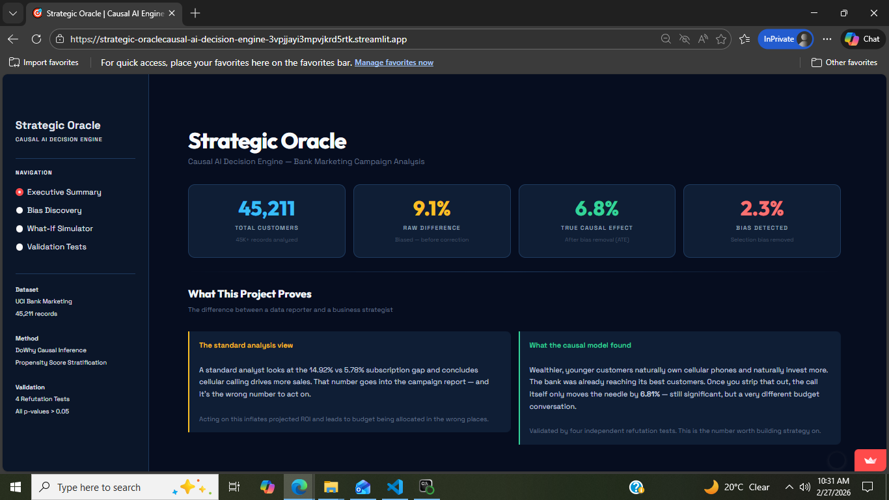
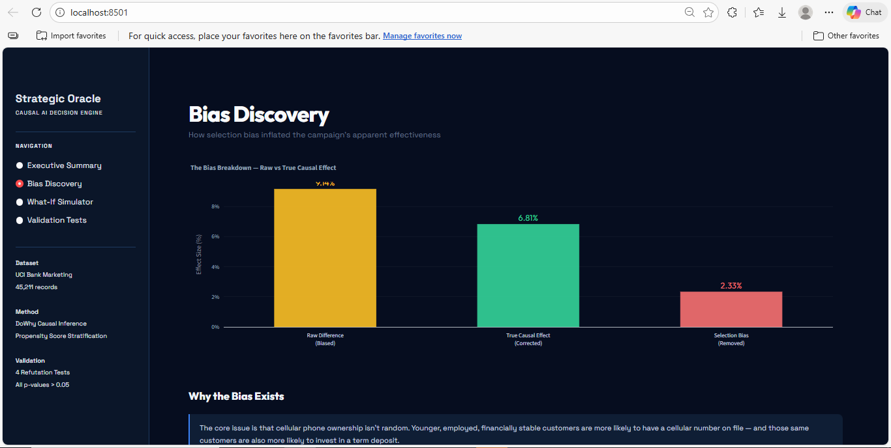

# Strategic Oracle — Causal AI Decision Engine

A causal inference project that goes beyond standard predictive analysis to answer the question most data analysts skip: not just *what* predicts a customer subscribing to a term deposit, but *what actually causes it*.

Built on Microsoft's DoWhy library using the UCI Bank Marketing dataset (45,211 records). The project identifies, estimates, and validates the true causal effect of cellular contact on subscription probability — then wraps the findings in an interactive Streamlit dashboard designed for business decision-making.

**Live dashboard:** [strategic-oracle.streamlit.app](https://strategic-oracle.streamlit.app)
<p align="center">
  
  
</p>

---

## The Problem

Standard analysis of this dataset shows that customers contacted via cellular subscribe at 14.92%, compared to 5.78% for other contact methods — a gap of 9.14%. A typical report would stop there and recommend increasing cellular outreach.

The problem is that this gap is partly driven by who owns a cellular phone, not the call itself. Younger, wealthier, more financially active customers are more likely to have a cellular number on file — and those same customers are also more likely to invest in a term deposit regardless of how they were contacted. Acting on the raw 9.14% figure overstates the true effect and leads to budget being allocated based on correlation, not causation.

---

## What the Causal Model Found

After controlling for demographic confounders using propensity score stratification, the true Average Treatment Effect (ATE) of cellular contact is **6.81%**.

The remaining 2.33% was selection bias — customers who would have subscribed anyway. This distinction matters when projecting campaign ROI. A bank planning a 50,000-customer campaign using the raw 9.14% figure would overestimate subscriptions by over 1,000 and misallocate a significant portion of its calling budget.

---

## Validation

The 6.81% finding was tested with four independent refutation tests from DoWhy:

| Test | Result | P-Value |
|---|---|---|
| Placebo Treatment | New effect collapsed to 0.0007 | 0.411 |
| Random Common Cause | ATE unchanged at 0.0681 | 0.159 |
| Data Subset (90%) | ATE shifted 0.6% to 0.0677 | 0.419 |
| Bootstrap (20x) | ATE averaged 0.0682 | 0.481 |

All four p-values exceed 0.05, confirming the result is statistically robust and not sensitive to which rows are in the dataset, which variables are included, or how the data is sampled.

---

## Project Structure

```
strategic-oracle/
    cleaning.py           — loads and prepares the raw dataset
    causal_model.py       — builds the DAG, runs DoWhy, outputs the ATE
    refutation_tests.py   — four validation tests against the causal estimate
    app.py                — Streamlit dashboard
    bank-full.csv         — original UCI dataset (semicolon-separated)
    requirements.txt
    LICENSE
```

---

## How to Run Locally

**1. Clone the repo**
```
git clone https://github.com/yourusername/strategic-oracle.git
cd strategic-oracle
```

**2. Install dependencies**
```
pip install -r requirements.txt
```

**3. Run the pipeline in order**
```
python cleaning.py
python causal_model.py
python refutation_tests.py
```

**4. Launch the dashboard**
```
streamlit run app.py
```

---

## Methodology

**Dataset:** UCI Bank Marketing — 45,211 customer records from a Portuguese bank's telemarketing campaigns. Target variable is whether the customer subscribed to a term deposit.

**Causal graph (DAG):** Built using networkx. Confounders — age, job, education, marital status, account balance, housing loan, personal loan, and credit default — are connected to both treatment and outcome. Previous campaign history (poutcome, was_previously_contacted) connects to outcome only. Post-treatment variables (call duration, campaign count, contact timing) were deliberately excluded to avoid collider bias.

**Estimation method:** Backdoor criterion with propensity score stratification. Customers are grouped by their likelihood of being contacted via cellular based on demographics. Within each group, customers are comparable, so the remaining difference in subscription rates reflects the causal effect of the call itself.

**Why DoWhy:** Most causal inference libraries either require strong parametric assumptions or don't provide built-in validation. DoWhy combines graph-based identification with multiple estimation methods and — critically — a refutation framework that makes it possible to stress-test the finding systematically.

---

## Dashboard

The Streamlit dashboard has four pages:

**Executive Summary** — headline metrics, the bias vs true effect comparison, and dataset overview charts.

**Bias Discovery** — visual breakdown of where the 2.33% bias comes from and why demographic confounders inflate the raw difference.

**What-If Simulator** — input campaign size, revenue per subscription, and call costs to get a live Proceed/Hold recommendation based on the true causal economics. Includes a profit projection chart across campaign scales.

**Validation Tests** — detailed results from all four refutation tests with p-values, ATE shifts, and explanations of what each test proves.

---

## Tech Stack

Python, DoWhy, networkx, pandas, scikit-learn, Streamlit, Plotly

---

## Dataset Source

Moro, S., Cortez, P., & Rita, P. (2014). A Data-Driven Approach to Predict the Success of Bank Telemarketing. Decision Support Systems. UCI Machine Learning Repository.
